# Архитектурные Диаграммы: Мультиагентная Платформа Cloud.ru
## Визуализация Компонентов и Интеграций

---

## 1. High-Level System Architecture

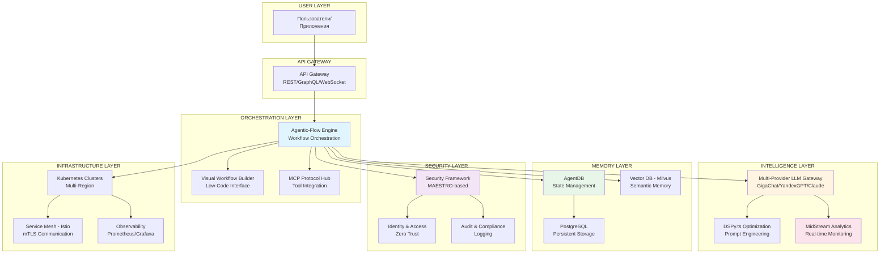

---

## 2. Technology Stack Integration

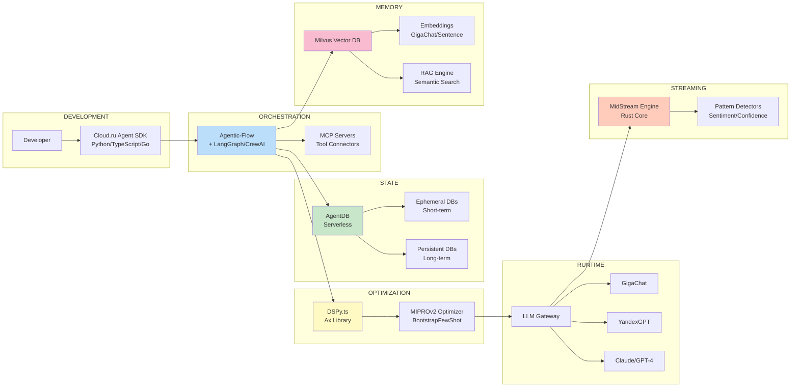

---

## 3. Agent Lifecycle & Data Flow

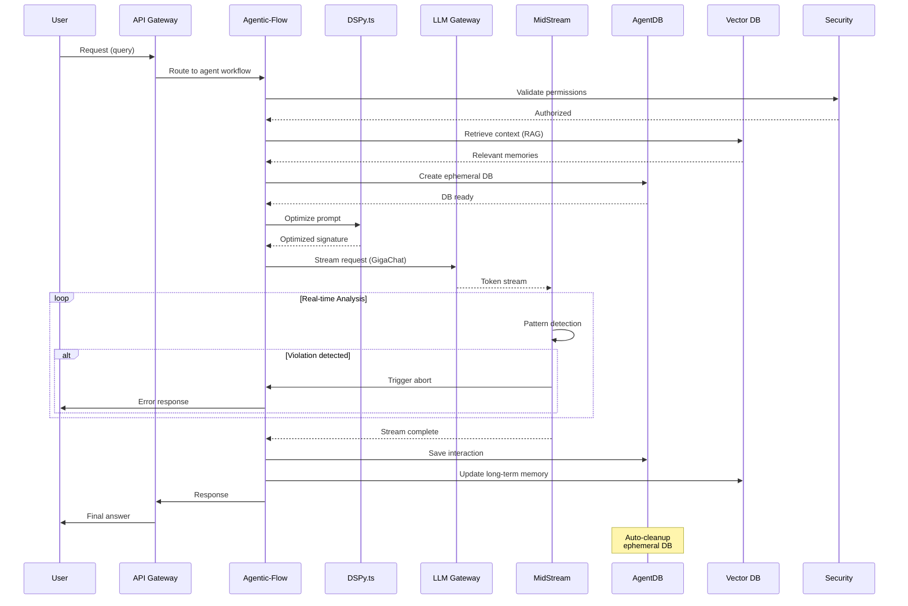

---

## 4. Multi-Agent Orchestration Patterns

### Pattern 1: Orchestrator-Workers

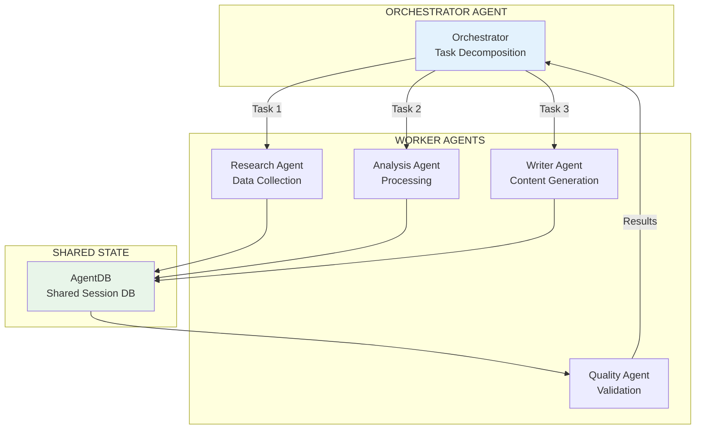

### Pattern 2: Peer-to-Peer Collaboration

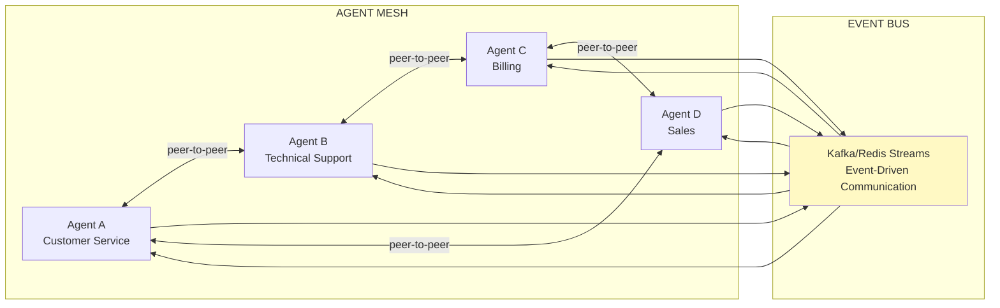

---

## 5. Security Architecture (Defense in Depth)

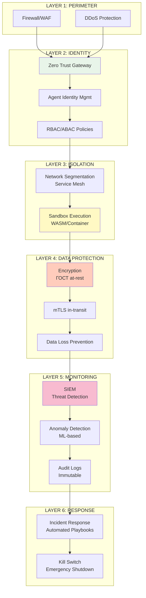

---

## 6. Memory Architecture (3-Tier)

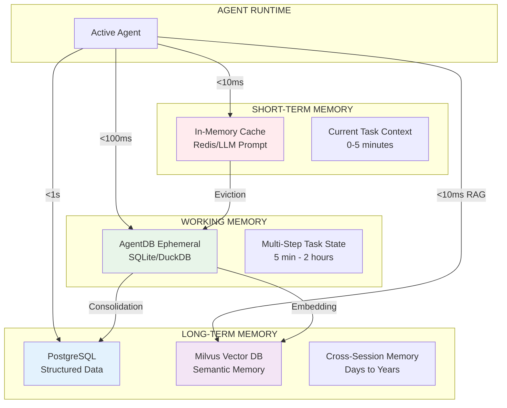

---

## 7. MCP Ecosystem Integration

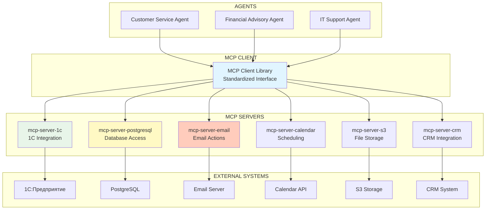

---

## 8. DSPy Optimization Pipeline

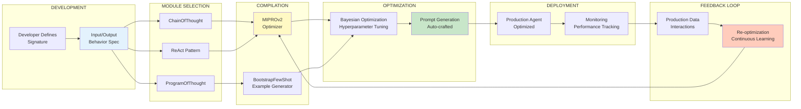

---

## 9. Real-time Streaming with MidStream

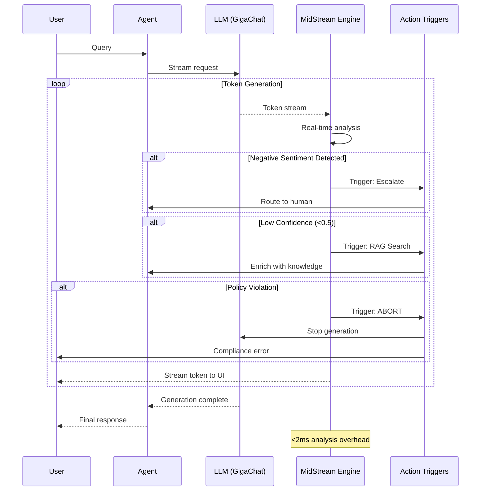

---

## 10. Hybrid Cloud Deployment Architecture

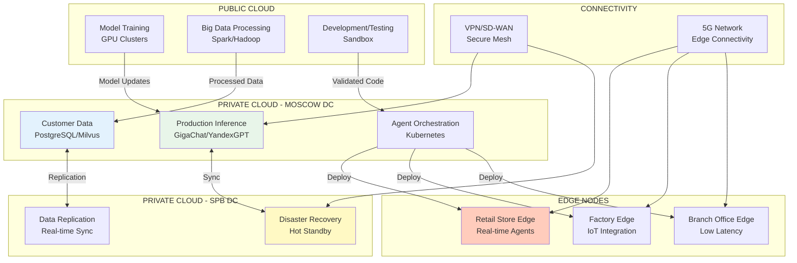

---

## 11. Observability & Monitoring Stack

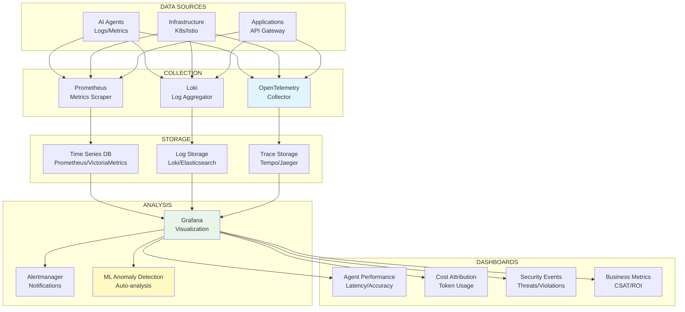

---

## 12. Deployment Pipeline (CI/CD)

```mermaid
graph LR
    subgraph "DEVELOPMENT"
        CODE[Developer<br/>Commits Code]
        GIT[GitLab<br/>Version Control]
    end

    subgraph "BUILD"
        CI[CI Pipeline<br/>Build & Test]
        SCAN[Security Scan<br/>SAST/Dependency]
        TEST[Automated Tests<br/>Unit/Integration]
    end

    subgraph "OPTIMIZATION"
        DSPY_OPT[DSPy Compilation<br/>Prompt Optimization]
        BENCH[Benchmarking<br/>Performance Tests]
    end

    subgraph "STAGING"
        STG[Staging Environment<br/>K8s Namespace]
        QA[QA Testing<br/>Manual/Automated]
        SECURITY[Security Review<br/>Penetration Test]
    end

    subgraph "PRODUCTION"
        CANARY[Canary Deployment<br/>10% Traffic]
        MONITOR[Monitor Metrics<br/>Error Rate/Latency]
        ROLLOUT[Progressive Rollout<br/>100% Traffic]
    end

    CODE --> GIT
    GIT --> CI
    CI --> SCAN
    SCAN --> TEST
    TEST --> DSPY_OPT
    DSPY_OPT --> BENCH
    BENCH --> STG
    STG --> QA
    QA --> SECURITY
    SECURITY --> CANARY
    CANARY --> MONITOR
    MONITOR -->|Success| ROLLOUT
    MONITOR -->|Failure| STG

    style DSPY_OPT fill:#fff9c4
    style SECURITY fill:#ffccbc
    style MONITOR fill:#e8f5e9
```

---

## 13. Cost Attribution & Optimization

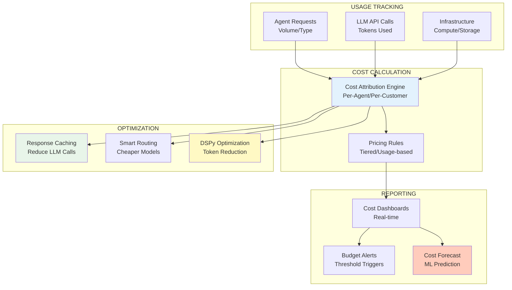

---

## 14. Customer Journey: Agent Deployment

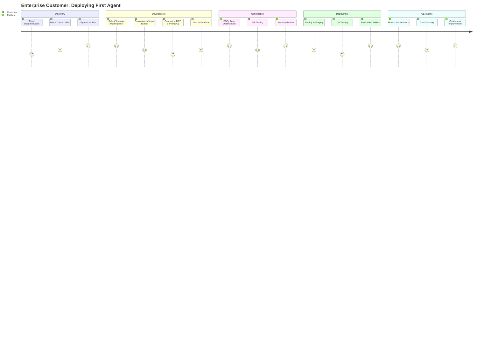

---

## 15. Technology Evolution Roadmap

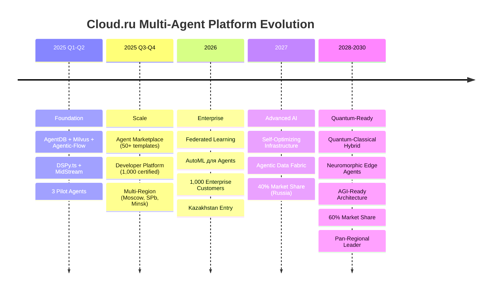

---

## 16. Risk Mitigation Architecture

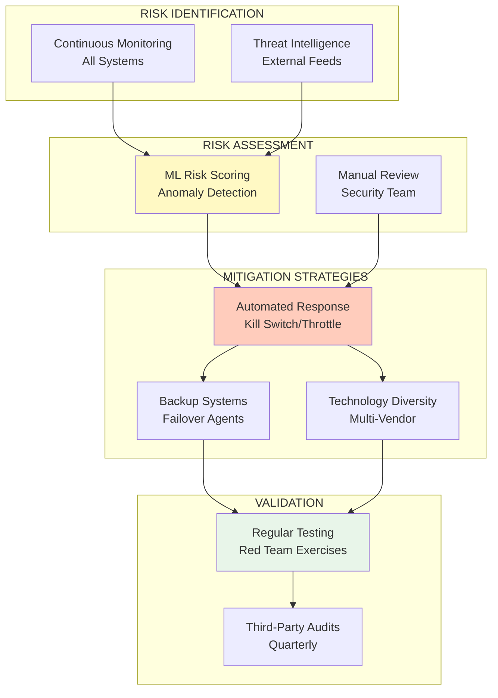

---

## Использование Диаграмм

### Инструменты для Визуализации

**Online (Browser-based):**
- [Mermaid Live Editor](https://mermaid.live/) — просто скопируйте код диаграммы
- [GitHub/GitLab](https://github.com) — встроенная поддержка Mermaid в README.md

**Desktop:**
- VS Code с расширением "Markdown Preview Mermaid Support"
- IntelliJ IDEA с плагином Mermaid

**Export:**
```bash
# Установите Mermaid CLI
npm install -g @mermaid-js/mermaid-cli

# Экспорт в PNG
mmdc -i diagram.mmd -o diagram.png

# Экспорт в SVG
mmdc -i diagram.mmd -o diagram.svg
```

### Рекомендации для Презентаций

**Executive Presentation (C-Level):**
- Диаграммы #1 (High-Level Architecture)
- Диаграммы #10 (Hybrid Cloud Deployment)
- Диаграммы #13 (Cost Optimization)
- Диаграммы #15 (Evolution Roadmap)

**Technical Audience (Engineers):**
- Диаграммы #2 (Technology Stack)
- Диаграммы #3 (Data Flow)
- Диаграммы #6 (Memory Architecture)
- Диаграммы #8 (DSPy Pipeline)
- Диаграммы #12 (CI/CD)

**Security Review:**
- Диаграммы #5 (Security Layers)
- Диаграммы #16 (Risk Mitigation)

**Sales/Marketing:**
- Диаграммы #14 (Customer Journey)
- Диаграммы #7 (MCP Ecosystem)

---

## Дополнительные Визуализации

### Performance Comparison Chart (ASCII)

```
Token Usage Optimization (DSPy vs Manual):

Manual Prompting   ████████████████████ 2,500 tokens

DSPy Optimized     ██████████ 1,200 tokens (-52%)

                   ↓ 52% reduction = $260/1M requests saved
```

### Cost Savings Timeline (ASCII)

```
Monthly Infrastructure Costs:

Traditional Stack  $$$$$$$$$$$$$$$$$$$ $50K/month

Cloud.ru Stack     $$$$$$$$$ $15K/month

Savings:           ↓ 70% = $420K/year
```

### Adoption Curve (ASCII)

```
Enterprise Customers:

2025 Q1  ▂ 3
2025 Q2  ▃ 10
2025 Q3  ▄▄ 50
2025 Q4  ▅▅▅ 100
2026 Q1  ▆▆▆▆ 250
2026 Q2  ▇▇▇▇▇ 500
2026 Q3  ████████ 750
2026 Q4  ██████████ 1,000 ← Target
```

---

**Документ подготовлен**: Ноябрь 2025
**Версия**: 1.0
**Формат**: Mermaid.js Diagrams
**Совместимость**: GitHub, GitLab, VS Code, Modern Browsers
